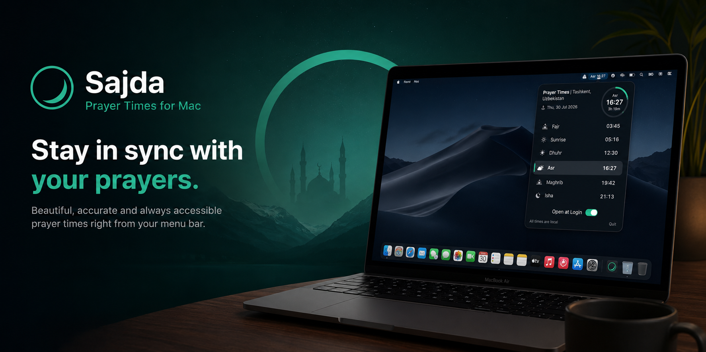

# Sajda

A lightweight macOS menu bar app for Islamic prayer times.

Sajda lives in your menu bar and shows the current prayer at a glance. Click it for today's full schedule, countdown ring, and location — with optional desktop widgets.

## Features

- **Menu bar** — current active prayer name and time, always visible
- **Daily schedule** — Fajr, Sunrise, Dhuhr, Asr, Maghrib, Isha
- **Countdown ring** — time remaining until the next prayer
- **Location caching** — remembers your location; only re-fetches if you move more than 5 km
- **Prayer notifications** — system notification at each prayer time
- **Hijri & Gregorian dates**
- **Desktop widgets** — small, medium, and large sizes
- **Launch at login** — reappears after reboot
- **IP fallback** — approximates location via IP when GPS is unavailable

## Requirements

- macOS 14.0 or later
- Xcode 15+ (to build from source)

## Install

### Download (easiest)

1. Go to [Releases](https://github.com/Firdavs-coder/Sajda/releases/latest) and download `Sajda.dmg`
2. Open the DMG and drag **Sajda** into **Applications**
3. Launch the app — it appears in the menu bar

> **First launch:** macOS may show a security prompt. Open **System Settings → Privacy & Security** and click **Open Anyway**.

### Build from source

```bash
open Sajda.xcodeproj
```

Select the **Sajda** scheme and run (⌘R).

### Create a DMG

```bash
./scripts/make-dmg.sh
```

Output: `dist/Sajda.dmg`

## Usage

1. Launch **Sajda** — the current prayer appears in the menu bar
2. Click it for the full day panel with countdown ring
3. Allow **Location** when prompted (saved for future launches)
4. Allow **Notifications** to receive an alert at each prayer time
5. Add a **Sajda** widget from the macOS widget gallery (optional)

## Privacy

Prayer times are fetched from the [Aladhan API](https://aladhan.com/prayer-times-api). Your location coordinates are stored locally on your device only (in `UserDefaults`) and are never sent to any Sajda server. Location is used solely to request prayer times for your area.

## License

[MIT](LICENSE)
